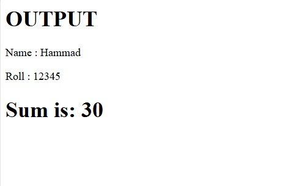

# **📄 Assignment:** JavaScript Function – Sum of Two Numbers

## Student Details 

Name: __________

Roll Number: _______

> ⚠️ Note: Agar Name aur Roll Number na diye, assignment accept nahi hoga.

## Assignment Statement

- Aik function create karo jiska naam addNumbers ho.
- Function do numbers (num1 aur num2) parameters me receive kare.
- Function me un dono numbers ka sum calculate karo aur variable sum me store karo.
- Function sum ko return kare.
- Function ko call karo aur return value ko variable result me store karo.

- Output screen par show karo.

> ⚠️ Note: Assignment check student by student kiya jayega.

Function will be called directly, not using onclick